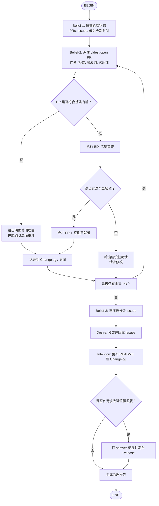

# Kimi Skills 公开仓库治理（BDI + Flow）

> 核心理念：**一个健康的 Skills 共享仓库，不是靠代码量堆出来的，而是靠清晰的信念（质量标准）、一致的愿望（社区共建）和坚定的意图（流程执行）治理出来的。**

---

## BDI 框架映射

### Belief（信念）—— 我对仓库状态的认知

在治理仓库前，Agent 必须建立以下信念：
- **仓库当前状态**：有多少 open PR？多少未分类 Issue？最后一次更新是什么时候？
- **PR 作者背景**：是新贡献者还是老熟人？是否签署过 CLA（如有）？
- **PR 内容质量**：SKILL.md 格式是否合规？是否包含 `type: flow`？是否有清晰触发词？
- **文档一致性**：README 是否反映了最新 skill 列表？Changelog 是否更新？
- **社区氛围**：Issue 回复是否及时？未回应的 PR 是否超过 7 天？

### Desire（愿望）—— 我希望仓库发展成什么样

- **D1 质量优先**：每个 merged skill 都必须是可直接运行的、文档完整的、有明确触发词的。
- **D2 社区友好**：新贡献者能在 5 分钟内理解如何提交 PR，并在 48 小时内收到 maintainer 反馈。
- **D3 可持续发展**：仓库不因 maintainer 的个人忙碌而腐烂，有明确的交接/备份机制。
- **D4 兼容性**：所有 skills 遵循统一的 `SKILL.md` 标准（兼容 Kimi CLI / Claude Code / Google ADK / OpenClaw）。

### Intention（意图）—— 我决定并承诺执行的治理动作

从多个愿望中，我们筛选出可立即执行的意图：
1. **审查并处理所有 open PR**（质量门 + 反馈循环）
2. **分类并回应未处理 Issue**（社区互动）
3. **维护 README 与 Changelog**（文档同步）
4. **发布新版本标签**（semver，当累积足够多的改进时）

---

## 流程图



---

## 节点详细指引

### B1: 扫描仓库状态

**执行命令**：
```bash
gh pr list --repo {owner}/{repo} --state open --limit 20
gh issue list --repo {owner}/{repo} --state open --limit 20
```

**输出要求**：
- Open PR 数量、最老 PR 的年龄（天）、平均无响应时间
- Open Issue 数量、无标签 Issue 数量
- 最近一次 commit 或 release 的时间

---

### B2: 评估 oldest open PR

对每个 PR，检查以下信念：

| 检查项 | 信念内容 | 最低要求 |
|--------|---------|---------|
| **作者** | 首次贡献者 / 回头客 | 无限制，但首次贡献者需要更多指导 |
| **文件结构** | 是否 `skill-name/SKILL.md` | 必须是标准目录结构 |
| **Frontmatter** | `name`, `description`, `triggers` 是否完整 | `name` 必须 kebab-case；`description` 必须说明触发场景 |
| **类型** | 是否为 `type: flow`（如适用） | Flow Skill 必须包含 Mermaid/D2 流程图 |
| **触发词** | 是否有 3+ 个自然语言触发词 | 必须覆盖中文和/或英文常见表达 |
| **实用性** | 这个 skill 是否解决了一个真实、可复用的问题 | 拒绝过于个人化、一次性、与现有 skill 高度重复的提交 |

---

### D: 基础门槛判断

**不通过的情况（直接关闭 PR）**：
- 缺少 `SKILL.md`
- `name` 与目录名不一致
- 包含恶意代码、侵权内容、政治敏感内容
- 与现有 skill 100% 重复（无任何增量价值）

**关闭话术模板**：
> "感谢贡献！但这个 PR 目前 {原因}。建议你 {改进方向}，修改后欢迎重新提交。"

---

### H: BDI 深度审查

对通过基础门槛的 PR，执行以下检查：

#### 1. 格式合规性（B）
- `SKILL.md` 是否在 500 行以内？（过长应拆分为 reference 文件）
- 是否使用了相对路径引用辅助文件？
- 是否提供了清晰的步骤指引、输入输出示例、边界情况说明？

#### 2. 触发词质量（D）
- 触发词是否过于宽泛（如只写了 "help"）？
- 是否与其他已合并 skill 的触发词冲突？

#### 3. 可运行性验证（I）
- 如 skill 包含 shell 命令示例，是否在本地可复现？
- 如为 Flow Skill，流程图是否包含 `BEGIN` 和 `END`？

#### 4. 文档完整性（D）
- 是否有 `README.md` 更新（如果这是新 skill 的首次提交）？
- 是否更新了仓库根目录的 skill 索引表？

**审查反馈模板（请求修改）**：
```markdown
@{作者} 感谢你的贡献！这个 skill 很有价值，但在合并前还需要几点调整：

1. {具体问题}
2. {具体建议}
3. {可运行性验证结果}

请在修改后 @ 我，我会尽快重新审查。
```

---

### K: 合并 PR

**合并策略选择**：

| 策略 | 适用场景 | 命令 |
|------|---------|------|
| **Squash and merge** | PR 包含多个杂乱 commit，但总体是一个完整功能 | 推荐（保持 main 分支整洁）|
| **Merge commit** | PR 本身结构清晰，作者有良好 commit 习惯 | 可选 |
| **Rebase and merge** | 需要线性历史，无冲突 | 可选 |

**合并后必做**：
1. 在 PR 评论中感谢贡献者
2. 更新 `README.md` 中的 skill 列表
3. 在 `CHANGELOG.md` 中记录新增/修改
4. 如贡献者是首次提交，在 `CONTRIBUTORS.md` 中记录

---

### L & M: Issue 分类与回应

**Issue 分类标签体系**：

| 标签 | 含义 | 响应时效 |
|------|------|---------|
| `bug` | skill 执行异常 | 48h |
| `enhancement` | 功能增强建议 | 7d |
| `new-skill` | 新 skill 提案 | 7d |
| `duplicate` | 与已有 issue/skill 重复 | 24h（关闭并引用原 issue）|
| `question` | 使用疑问 | 48h |
| `good first issue` | 适合新贡献者的简单任务 | 不紧急，但保持 open |

**回应模板**：
- **Bug**："感谢反馈，能否提供复现步骤和错误输出？"
- **Enhancement**："这个方向不错，欢迎直接提交 PR！"
- **Question**："请参考 {链接}，如果还有疑问请继续追问。"
- **Duplicate**："这个问题与 #{编号} 类似，请关注那边的进展。"

---

### N: 更新 README 和 Changelog

#### README.md 维护规范
仓库根目录 `README.md` 必须包含：

```markdown
## 已收录 Skills

| Skill | 类型 | 描述 | 作者 |
|-------|------|------|------|
| system-audit | Flow | macOS 系统审计清理 | @maintainer |
| project-onboarding | Flow | 新项目初始化 | @maintainer |
| memory-recovery | Skill | 记忆恢复中枢 | @maintainer |
| ... | ... | ... | ... |

## 如何贡献

1. Fork 本仓库
2. 在 `skills/` 目录下创建 `your-skill-name/SKILL.md`
3. 提交 PR，等待 BDI 审查

详见 [CONTRIBUTING.md](./CONTRIBUTING.md)
```

#### CHANGELOG.md 维护规范

```markdown
## [Unreleased]

### Added
- {skill-name}: {一句话描述} (by @{贡献者})

### Fixed
- {skill-name}: {修复内容}
```

每次合并 PR 后，立即在 `[Unreleased]` 下追加条目。发布版本时，将 `[Unreleased]` 改为具体版本号。

---

### O & P: 版本发布

**Semver 规则**：

| 版本号变化 | 触发条件 | 示例 |
|-----------|---------|------|
| **Major (x.0.0)** | 删除已有 skill、破坏性变更触发词、不兼容旧标准 | 极少发生 |
| **Minor (0.x.0)** | 新增 skill、新增 Flow Skill、重大功能增强 | 最常用 |
| **Patch (0.0.x)** | 修复 skill 错误、更新文档、调整触发词 | 常用 |

**发布流程**：
1. 将 `CHANGELOG.md` 中的 `[Unreleased]` 改为 `## [0.x.0] - YYYY-MM-DD`
2. 提交 commit：`git commit -m "Release v0.x.0"`
3. 打标签：`git tag -a v0.x.0 -m "Release v0.x.0"`
4. 推送到 GitHub：`git push origin main --tags`
5. 创建 GitHub Release，附上 CHANGELOG 摘要

---

## BDI 快速诊断清单（PR 审查用）

| 维度 | 检查问题 |
|------|---------|
| **B - 信念** | 这个 skill 解决了一个真实、可复用的问题吗？作者是否理解现有 skill 的边界？ |
| **D - 愿望** | 这个 skill 是否与仓库的质量标准、兼容性目标、社区友好原则一致？ |
| **I - 意图** | PR 作者是否承诺了维护这个 skill？如果这是一个一次性提交，文档是否足够自解释？ |
| **Deliberation** | 接受这个 PR 会给仓库带来什么长期负担？拒绝它是否会打击新贡献者？ |
| **Means-End** | 合并后，README、Changelog、索引是否需要更新？更新动作是否已明确？ |
| **Reconsideration** | 如果未来这个 skill 与另一个 skill 冲突，是否有清晰的命名空间或触发词优先级规则？ |

---

## 贡献者指南模板（CONTRIBUTING.md）

```markdown
# 贡献指南

## 提交 Skill 前必读

1. **阅读现有 skills**：避免重复造轮子。
2. **遵循标准格式**：每个 skill 必须包含 `SKILL.md`，frontmatter 必须完整。
3. **触发词要自然**：至少 3 个，覆盖中文/英文常见表达。
4. **Flow Skill 必须含流程图**：使用 Mermaid 或 D2，包含 `BEGIN` 和 `END`。
5. **保持简洁**：`SKILL.md` 尽量在 500 行以内。
6. **接受 BDI 审查**：所有 PR 都会经过信念-愿望-意图三层的质量审查。

## 审查时效

- 首次提交：通常 3-5 天内反馈
- 修改后重审：通常 24-48 小时内反馈

## 行为准则

- 尊重不同水平贡献者
- 反馈必须建设性
- 争议通过 Issue 公开讨论
```

---

## 安全红线

1. **绝不合并包含未脱敏 API Key、私钥、系统路径的 PR**
2. **绝不合并恶意或可能诱导 Agent 执行有害操作的 skill**
3. **所有 Flow Skill 必须经过至少一轮实际运行验证**
4. ** contributor 的首次 PR 必须得到 human maintainer 的最终确认**（即使有 AI 辅助审查）

---

## 一句话总结

> **好的 Skills 仓库不是技能的数量竞赛，而是质量的信仰共同体。**
>
> 用 BDI 审查每一个 PR，用 Flow 规范每一次发布，用清晰的文档欢迎每一个新贡献者。
