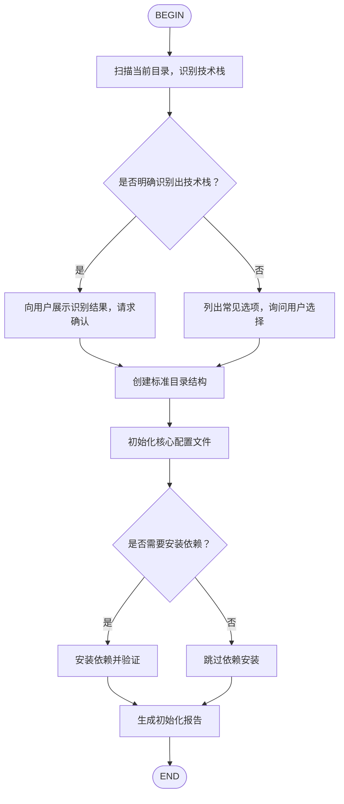

# 新项目初始化工作流（Project Onboarding Flow）

## 适用场景

- 从零开始一个新项目
- 克隆仓库后做本地环境初始化
- 为已有代码补全标准化配置

## 流程图



## 各节点详细指引

### B: 识别技术栈

扫描当前目录中的标志性文件：

| 文件/扩展名 | 推断技术栈 |
|------------|-----------|
| `package.json` | Node.js / 前端项目 |
| `Cargo.toml` | Rust |
| `go.mod` | Go |
| `pyproject.toml` / `requirements.txt` | Python |
| `pom.xml` / `build.gradle` | Java |
| `Gemfile` | Ruby |
| `composer.json` | PHP |
| `CMakeLists.txt` | C++ |
| `*.swift` | Swift |
| `*.kt` | Kotlin |

输出要求：
- 列出识别到的所有技术栈信号
- 给出置信度评分（高/中/低）
- 如果是混合项目（如前端+后端在同一目录），分别说明

### D/E: 与用户确认

**若识别成功**：
> "我检测到这是一个 **{技术栈}** 项目，置信度 **高**。接下来我将：
> 1. 创建标准目录结构
> 2. 初始化 git + {对应配置文件}
> 3. {安装依赖 / 跳过依赖安装}
> 
> 确认继续吗？"

**若识别失败**：
> "当前目录没有明显的技术栈标识。请从以下选项中选择：
> - A. Node.js / 前端
> - B. Python
> - C. Go
> - D. Rust
> - E. 其他（请说明）"

### F: 创建标准目录结构

根据确认的技术栈，创建对应目录：

**通用结构（所有项目）**：
```
.
├── src/           # 源代码
├── tests/         # 测试文件
├── docs/          # 文档
├── scripts/       # 工具脚本
├── .github/       # CI/CD 配置
└── README.md      # 项目说明
```

**Node.js 补充**：
```
├── src/
├── tests/
├── public/        # 静态资源（如适用）
├── dist/          # 构建输出（gitignore）
```

**Python 补充**：
```
├── src/{project_name}/
├── tests/
├── notebooks/     # Jupyter 笔记本
```

### G: 初始化核心配置文件

**通用（所有项目）**：
- `.gitignore`（基于 GitHub 官方模板）
- `README.md`（包含项目名称、安装说明、使用方式）
- `.editorconfig`

**Node.js**：
- `package.json`（如不存在）
- `.prettierrc`
- `eslint.config.js` 或 `.eslintrc.json`
- `tsconfig.json`（如检测到 TypeScript）

**Python**：
- `pyproject.toml`
- `.python-version`（如使用 pyenv）
- `ruff.toml`（ruff 配置）
- `pytest.ini`

**Go**：
- `go.mod`（如不存在）
- `.golangci.yml`

**Rust**：
- `Cargo.toml`（如不存在）
- `rustfmt.toml`

### I: 安装依赖并验证

**Node.js**：
```bash
npm install
npm test        # 或 npm run lint
```

**Python**：
```bash
uv sync         # 或 pip install -e ".[dev]"
pytest          # 或 python -c "import {package}"
```

**Go**：
```bash
go mod tidy
go test ./...
```

**Rust**：
```bash
cargo check
cargo test
```

### K: 生成初始化报告

```markdown
## 项目初始化报告 ✅

### 技术栈
{技术栈}

### 已创建目录
- src/
- tests/
- ...

### 已初始化配置
- .gitignore
- README.md
- ...

### 依赖状态
- {已安装并验证通过 / 已跳过}

### 下一步建议
1. ...
2. ...
```

## 执行原则

1. **不覆盖已有文件**——若文件已存在，询问用户是否覆盖或跳过
2. **保持最小可用**——只创建真正需要的配置，避免过度工程
3. **验证每一步**——创建目录后 `ls` 确认，安装依赖后运行测试验证
4. **尊重用户习惯**——若用户在 preferences 中指定了特定工具（如用 biome 替代 prettier），优先遵循
