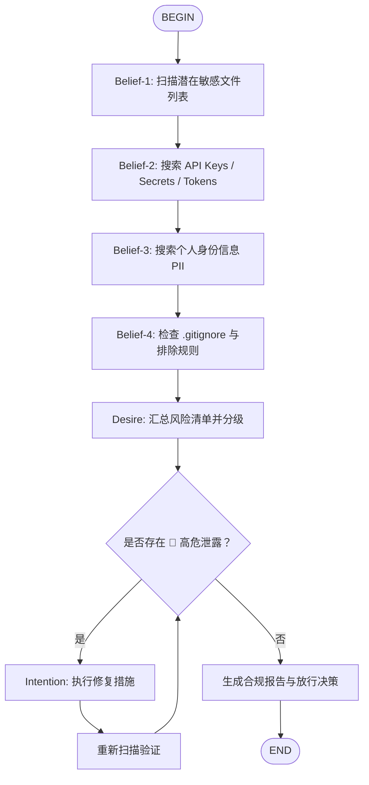

# 仓库隐私安全合规门（Repo Privacy & Security Gate）

> 设计理念：**在按下 `git push` 之前，让 Agent 先完成一轮 BDI 式的审慎思考。**

---

## BDI 框架映射

| BDI 要素 | 在仓库公开场景中的含义 |
|---------|----------------------|
| **Belief（信念）** | Agent 对当前目录内容的认知：哪些文件可能存在敏感信息？ |
| **Desire（愿望）** | 零敏感信息泄露、保护用户隐私和系统安全、维护职业声誉 |
| **Intention（意图）** | 承诺执行一套标准化的扫描-修复-验证流程，最终给出 **放行 / 有条件放行 / 阻断** 的明确决策 |

---

## 流程图



---

## 节点详细指引

### B1: 扫描潜在敏感文件

**执行命令**：
```bash
find . -maxdepth 3 -type f | grep -iE '\.(env|pem|key|p12|pfx|keystore|jks|htpasswd|netrc|npmrc|piprc|dockercfg|aws/credentials|ssh/config)$' | grep -v node_modules | grep -v '.git/'
```

**额外检查常见文件**：
- `.env` / `.env.local` / `.env.production`
- `.zshrc` / `.bashrc` / `.bash_profile`
- `config.json` / `settings.json` / `credentials.json`
- `id_rsa` / `id_ed25519` / `*.pem`
- `AGENTS.md` / `BASELINE.md`（可能含系统路径、IP、序列号）

**输出要求**：列出每个文件的路径和**建议处理方式**（删除 / 加入 .gitignore / 脱敏后保留）。

---

### B2: 搜索 API Keys / Secrets / Tokens

**执行命令**（使用 ripgrep）：
```bash
rg -i -n 'sk-[a-zA-Z0-9]{20,}|ghp_[a-zA-Z0-9]{30,}|AKIA[0-9A-Z]{16}|private[_-]?key|-----BEGIN (RSA |OPENSSH |EC )?PRIVATE KEY-----|bearer\s+[a-zA-Z0-9]{20,}|api[_-]?key\s*[:=]\s*["\']?[a-zA-Z0-9]{16,}' --hidden -g '!node_modules/' -g '!.git/' .
```

**重点关注模式**：
- OpenAI / Anthropic / Kimi API keys: `sk-...`
- GitHub Personal Access Token: `ghp_...`
- AWS Access Key: `AKIA...`
- SSH 私钥块: `-----BEGIN...PRIVATE KEY-----`
- 数据库连接字符串含密码
- Base64 编码的可疑长字符串（>40 字符且看似随机）

**输出要求**：
- 匹配到的文件名 + 行号
- 匹配的**前 8 个字符 + "..."**（不要完整打印 secret）
- 风险等级：🔴 高危

---

### B3: 搜索个人身份信息（PII）

**执行命令**：
```bash
rg -i -n '(1[3-9]\d{9}|\b[A-Za-z0-9._%+-]+@[A-Za-z0-9.-]+\.[A-Z|a-z]{2,}\b|172\.(1[6-9]|2[0-9]|3[01])\.\d+\.\d+|192\.168\.\d+\.\d+|10\.\d+\.\d+\.\d+|127\.0\.0\.1)' --hidden -g '!node_modules/' -g '!.git/' .
```

**额外检查系统特定信息**：
- 主机名 / 计算机名（如 `<hostname>`）
- 序列号（如 `<serial-number>`）
- 真实姓名、用户名（如 `<username>`）
- 身份证号、手机号
- 内网 IP 地址

**输出要求**：
- 列出匹配项及其所在文件
- 风险等级：🟡 中危（内网 IP、用户名）或 🔴 高危（手机号、身份证号）

---

### B4: 检查 .gitignore 与排除规则

**执行命令**：
```bash
cat .gitignore 2>/dev/null || echo "WARNING: No .gitignore found"
```

**必检清单**：`.gitignore` 是否包含以下内容？
- `node_modules/`
- `.env*`
- `.DS_Store`
- `dist/` / `build/` / `__pycache__/`
- `*.pem` / `*.key`
- `.zshrc` / `.bashrc` / `.zshenv`
- 本地日志 / 缓存目录

**输出要求**：
- 如果缺少 `.gitignore`：🔴 高危，建议立即创建
- 如果 `.gitignore` 缺失关键项：🟡 中危，建议补充

---

### F: 风险分级（Desire 阶段）

汇总 B1-B4 的发现，按以下标准分级：

| 等级 | 判定标准 | 处理原则 |
|------|---------|---------|
| 🔴 **高危** | API Key、密码、私钥、生产凭证、身份证号 | **必须修复后才能公开** |
| 🟡 **中危** | 内网 IP、用户名、主机名、序列号、邮箱 | **建议修复或脱敏** |
| 🟢 **低危** | 公开的 macOS 系统路径（如 `/Applications`）、通用配置 | **可接受，但建议说明** |

---

### G: 分支判断 — 是否存在 🔴 高危泄露？

Agent 必须诚实地评估：
- **如果有任意一个 🔴 项**：走 **"是"** 分支，进入修复流程
- **如果只有 🟡 或 🟢**：走 **"否"** 分支，生成报告并给出条件建议

---

### H: 执行修复措施（Intention 阶段）

**标准修复动作**（根据问题类型选择）：

1. **API Key / Secret 泄露**
   - 立即在文件中替换为占位符（如 `sk-xxxYOUR_API_KEYxxx`）
   - 提醒用户：**如果该 Key 曾暴露在 git 历史中，必须到对应平台撤销并重新生成**

2. **私钥文件被跟踪**
   - 将文件加入 `.gitignore`
   - 如果已在 git 历史中，必须执行 `git filter-repo` 或 BFG 清理历史

3. **个人系统信息（IP、序列号、用户名）**
   - 替换为占位符或泛化描述（如 `~/workspace/xxx` → `~/workspace/<project>`）

4. **缺少 .gitignore**
   - 创建标准 `.gitignore` 模板

5. **.zshrc / .zshenv 等配置文件**
   - **绝对不要推送到公有仓库**。加入 `.gitignore` 或用环境变量模板替代。

**重要约束**：
- 任何修改前，必须创建备份（如 `cp file file.bak.PRIVACY`）
- 修改后必须重新执行 B1-B4 的扫描验证

---

### I: 重新扫描验证

修复完成后，重新执行 B2 和 B3 的关键搜索命令，确认：
- 之前的匹配项是否已消失或被替换为占位符
- 没有引入新的敏感信息

如果仍有 🔴 项，循环回到 H 继续修复；如果清零，进入 J。

---

### J: 生成合规报告与放行决策

**输出格式**：

```markdown
# Repo Privacy Gate 合规报告

## 扫描范围
- 目录: {当前工作目录}
- 扫描文件数: {N}
- 检查维度: 敏感文件 / Secrets / PII / .gitignore

## 风险统计
- 🔴 高危: {N} 项
- 🟡 中危: {N} 项
- 🟢 低危: {N} 项

## 发现清单
{逐项列出}

## 已执行修复
{如有}

## 最终裁决
{以下三选一}
```

**裁决标准**：

| 状态 | 判定条件 | 图标 |
|------|---------|------|
| **禁止公开** | 存在未修复的 🔴 高危项，或 secret 已进入 git 历史且无法安全清理 | 🚫 |
| **有条件公开** | 无 🔴，但仍有 🟡 中危项（如用户名、内网 IP）——需用户确认是否接受 | ⚠️ |
| **可以公开** | 无 🔴 无 🟡，或所有风险项均已修复/脱敏 | ✅ |

---

## 使用示例

**用户**：我想把这个项目开源到 GitHub
**Agent**：加载 `repo-privacy-gate` → 执行 B1-B4 扫描 → 发现 `BASELINE.md` 中有主机名和序列号 🟡 → 建议替换为占位符 → 执行修复 → 重新验证 → 输出：✅ 可以公开

---

## 安全红线（不可妥协）

1. **永远不要建议用户把 `.env`、`.zshrc`、私钥文件推送到 public repo**
2. **只要发现 `ghp_`、`sk-`、私钥块中的任意一个未修复实例，必须给出 🚫 禁止公开的裁决**
3. **如果 secret 已进入 git commit 历史，必须提醒用户：仅仅删除文件是不够的，必须到对应平台撤销（revoke）并重新生成（rotate）该凭证。**