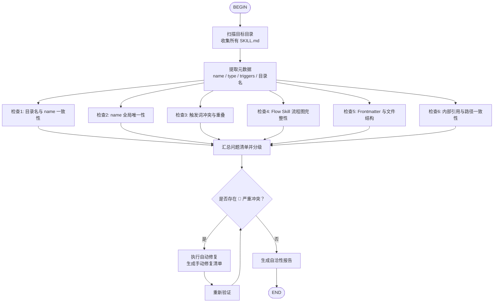

# Skills 库自洽性检查门（BDI + Flow）

> 核心理念：**单个 Skill 的质量固然重要，但整个 Skills 生态的协调一致才是长期可维护的关键。**
>
> 本 Skill 作为元治理工具（Meta-Governance），负责在 Skills 规模扩大时自动发现命名冲突、触发词重叠、结构不一致等问题。

---

## BDI 框架映射

### Belief（信念）—— 我对 Skills 库的认知

在检查自洽性前，Agent 必须建立以下信念：
- **总数与分布**：库中有多少个 Skill？有多少个 `type: flow`？
- **命名空间**：每个 Skill 的 `name` 是什么？目录名是否与之对应？
- **触发词地图**：所有触发词的全局分布如何？是否存在同一触发词被多个 Skill 声明的情况？
- **结构完整性**：每个 `SKILL.md` 的 Frontmatter 是否完整？文件大小是否合理？
- **Flow 合规性**：所有 `type: flow` 的 Skill 是否都包含有效的流程图（`flowchart` 或 `graph TD/RL/LR/BT`）？
- **引用正确性**：Skill 内部是否引用了已删除或重命名的其他 Skill？是否存在绝对路径泄露风险？

### Desire（愿望）—— 我希望 Skills 库达到什么状态

- **D1 命名唯一**：每个 Skill 的 `name` 和目录名一一对应，全局无重复。
- **D2 触发词清晰**：触发词有明确归属，高重叠触发词（如过于通用的 "help"）应被显式标注或调整。
- **D3 结构统一**：所有 Skill 遵循相同的 `SKILL.md` + 可选辅助文件的结构标准。
- **D4 流程图完整**：Flow Skill 必须包含从 `BEGIN` 到 `END` 的可读流程图。
- **D5 文档自洽**：一个 Skill 的描述、引用、示例中不应出现已废弃的名称或路径。

### Intention（意图）—— 我决定执行的检查与修复动作

1. **扫描并提取元数据**（建立 Belief）
2. **执行六维一致性检查**（验证 Desire）
3. **分级汇总并生成修复建议**（输出质量报告）
4. **对可自动修复的问题执行修复**（维护一致性）

---

## 流程图



---

## 节点详细指引

### B: 扫描目标目录

**默认扫描目标**：
```bash
# 本地 Skills 库
~/.kimi/skills/

# 或项目级 Skills 目录
./skills/
./.kimi/skills/
```

**执行命令**：
```bash
find {target_dir} -maxdepth 2 -name "SKILL.md" | sort
```

**输出要求**：
- Skill 总数
- 按目录结构列出的文件列表

---

### C: 提取元数据

对每个 `SKILL.md` 解析 Frontmatter 和关键内容：

| 字段 | 提取方式 | 用途 |
|------|---------|------|
| `name` | YAML frontmatter `name` | 唯一性检查 |
| `type` | YAML frontmatter `type` | Flow 合规检查 |
| `triggers` | YAML frontmatter `triggers` | 冲突检测 |
| `description` | YAML frontmatter `description` | 引用一致性检查 |
| 目录名 | 文件路径的父目录名 | 命名一致性检查 |
| 行数 | `wc -l` | 体积检查 |
| 流程图 | 搜索 `\`\`\`mermaid` 和 `flowchart`/`graph` | Flow 完整性检查 |

建议使用程序化脚本（Python）一次性批量提取，避免逐个文件调用工具造成上下文污染。

---

### D1: 目录名与 name 一致性

**规则**：`SKILL.md` 所在目录名必须与 frontmatter 中的 `name` 完全一致（kebab-case）。

**示例**：
- ✅ `~/.kimi/skills/system-audit/SKILL.md` → `name: system-audit`
- ❌ `~/.kimi/skills/system-audit/SKILL.md` → `name: system-audit-tool`（不一致）

**严重等级**：🟡 中（需手动确认重命名方向）

---

### D2: name 全局唯一性

**规则**：所有 Skill 的 `name` 必须在整个库中唯一。

**严重等级**：🔴 高（会导致引用歧义）

---

### D3: 触发词冲突与重叠

**规则**：
1. **完全重复**：同一触发词出现在两个或以上 Skill 中 → 默认 🔴 高
2. **映射中心豁免**：若某 Skill 明确为"快捷入口/映射中心"（description 含"映射"、"路由"、"快捷口令"等），且重叠的触发词为短口语词（≤ 4 个字符），则降级为 🟡 中。但专业术语/长短语仍不得共享。
3. **高度重叠**：触发词语义过于宽泛（如只写 "help"、"开始"、"检查"）→ 🟡 中
4. **子串包含**：触发词 A 是触发词 B 的子串（如 "audit" vs "system-audit"）→ 🟢 低（仅提示）

**处理方式**：
- 对 🔴 高重叠：建议至少一个 Skill 调整触发词，增加差异化前缀。
- 对 🟡 中重叠：在报告中标注，由 maintainer 决定是否调整。
- 对 🟢 低重叠：记录但不强制要求修改。

---

### D4: Flow Skill 流程图完整性

**规则**：
- `type: flow` 的 Skill 必须包含 Mermaid 代码块。
- Mermaid 代码块中必须包含 `flowchart` 或 `graph` 关键字。
- 强烈建议包含 `BEGIN` 和 `END` 节点（至少包含 `[BEGIN]` / `([BEGIN])` / `[END]` / `([END])`）。

**严重等级**：
- 缺少 Mermaid 块：🔴 高
- 缺少 `BEGIN/END`：🟡 中

---

### D5: Frontmatter 与文件结构

**规则**：
- 必须包含字段：`name`、`description`、`triggers`
- `description` 长度应在 20-500 字符之间
- `triggers` 数量应 ≥ 3
- `SKILL.md` 行数应 ≤ 1000 行（过长应拆分 reference）
- 文件编码应为 UTF-8

**严重等级**：
- 缺少必填字段：🔴 高
- triggers < 3：🟡 中
- 行数 > 1000：🟡 中
- description 过短：🟢 低

---

### D6: 内部引用与路径一致性

**规则**：
- Skill 内容中不应引用已删除/重命名的其他 Skill 名称。
- Skill 中不应出现绝对路径泄露（如 `/Users/<username>/...` 等未脱敏路径）。
- 相对路径引用（如 `./another-skill/SKILL.md`）应指向真实存在的文件。

**严重等级**：
- 绝对路径泄露：🔴 高（调用 `repo-privacy-gate` 二次确认）
- 引用已删除 Skill：🟡 中
- 相对路径失效：🟡 中

---

### E: 汇总问题清单并分级

**问题分级表**：

| 等级 | 含义 | 是否阻塞发版 |
|------|------|-------------|
| 🔴 高 | 命名冲突、重复 name、缺少流程图、路径泄露 | 是 |
| 🟡 中 | 目录名不一致、触发词过于宽泛、triggers < 3 | 建议修复 |
| 🟢 低 | description 过短、子串重叠 | 可选 |

---

### F ~ H: 修复与重新验证

**可自动修复的问题**：
- 描述中的拼写错误（如引用了已重命名的 skill）
- `SKILL.md` 末尾缺少空行
- `.gitignore` 中缺少标准的 `__pycache__/`、`node_modules/` 等条目（如在仓库级检查中）

**必须手动修复的问题**：
- name 重复（需要 maintainer 决定保留哪个或如何重命名）
- 触发词冲突（需要语义层面的判断）
- 目录名与 name 不一致（需要确认重命名方向）

**修复后重新验证**：重新运行 C → D1~D6 的全链路检查，直到 🔴 问题清零。

---

## 报告模板

```markdown
# Skills 库自洽性检查报告

> 检查时间：{YYYY-MM-DD HH:MM}
> 检查目录：{path}
> Skill 总数：{N}（Flow Skill: {M}）

## 总体结论

{🚫 存在阻塞问题 / ⚠️ 存在建议优化项 / ✅ 全部通过}

## 详细问题清单

### 🔴 严重问题（{count} 项）
1. **{skill-name}**: {问题描述} → {修复建议}
...

### 🟡 中等问题（{count} 项）
1. **{skill-name}**: {问题描述} → {修复建议}
...

### 🟢 轻微问题（{count} 项）
1. **{skill-name}**: {问题描述} → {可选修复}
...

## 触发词热力图（Top 重叠）

| 触发词 | 出现次数 | 涉及 Skills |
|--------|---------|------------|
| {trigger} | {count} | {skill1}, {skill2} |

## 下一步行动

- [ ] 修复 🔴 问题
- [ ] 评估 🟡 问题
- [ ] 重新运行自洽性检查
- [ ] 更新 CHANGELOG
```

---

## 程序化工具调用建议

由于本 Skill 涉及批量文件解析和统计计算，**强烈建议使用 Python 脚本**一次性完成元数据提取和冲突检测，而非逐个文件使用工具调用。

示例脚本逻辑：
```python
import yaml, glob, re, collections

skills = {}
for path in glob.glob("~/.kimi/skills/*/SKILL.md"):
    dir_name = path.split("/")[-2]
    with open(path) as f:
        text = f.read()
    # parse frontmatter, count triggers, detect mermaid, etc.
    # populate conflicts, overlaps, inconsistencies
```

> 参见 `programmatic-tools` Skill：当脚本失败两次时，退回到传统逐步工具调用。

---

## 安全与兼容性红线

1. **扫描过程中发现的绝对路径泄露必须立即上报**，并触发 `repo-privacy-gate` 二次审查。
2. **绝不自动重命名已稳定使用的 Skill**，除非得到明确的人类确认（避免破坏依赖）。
3. **所有修改建议必须通过 PR / 显式 commit 提交**，禁止直接覆盖生产文件而不留版本记录。
4. **Flow Skill 的流程图修改需人工确认逻辑等价性**，禁止仅为了格式通过而破坏流程语义。

---

## 一句话总结

> **Skills 不是孤岛。**
>
> 当数量超过 5 个时，自洽性检查就应成为每次发版前的标准流程。用 `self-consistency-gate` 守住命名空间、触发词地图和结构标准，让 Skills 生态越建越稳。
