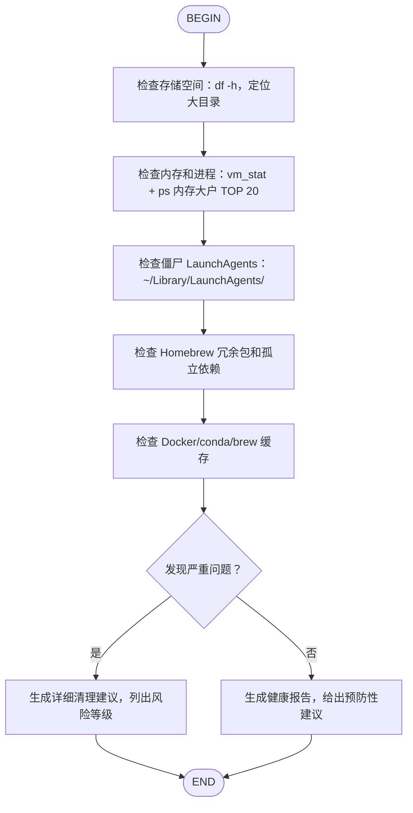

# 系统审计与清理工作流（System Audit Flow）

## 适用场景

- 用户感觉电脑变慢
- 定期系统维护（建议每月一次）
- 安装大量软件后的后遗症排查
- 登录变慢、风扇狂转、磁盘空间告警

## 流程图



## 各节点详细指引

### B: 检查存储空间

执行以下命令并分析：
```bash
df -h /System/Volumes/Data
du -sh ~/Library/Containers/com.docker.docker 2>/dev/null
du -sh /usr/local/anaconda3 2>/dev/null
du -sh ~/Library/Caches 2>/dev/null
```

输出要求：
- 标记使用率 >80% 的卷为 🔴 高风险
- 标记使用率 68%-80% 为 🟠 中风险
- 列出 TOP 3 大目录及其占用

### C: 检查内存和进程

执行：
```bash
vm_stat
ps -caxm -orss,comm | awk '{nr[$2]+=$1} END {for (i in nr) printf "%10.1f MB  %s\n", nr[i]/1024, i}' | sort -rn | head -20
```

输出要求：
- 列出 TOP 5 内存大户
- 如果通讯类应用（Lark/WeChat/企微）总和 >3GB，标注为可优化项
- 如果总进程数 >800，建议排查僵尸进程

### D: 检查僵尸 LaunchAgents

执行：
```bash
ls ~/Library/LaunchAgents/
launchctl list | grep -v "com.apple"
ls ~/Library/LaunchAgents.disabled/ 2>/dev/null
```

输出要求：
- 列出所有非 Apple 的活跃 LaunchAgent
- 对明显废弃的（如已卸载软件的残留）建议移除或禁用
- 对第三方服务（Google Updater、Steam、乐播等）建议评估必要性

### E: 检查 Homebrew 冗余

执行：
```bash
brew leaves
brew list --formula | wc -l
brew services list
```

输出要求：
- 检查是否存在与版本管理器冲突的系统级包（如 fnm + node 共存）
- 检查是否存在已停止服务但包仍在的（mariadb、mongodb、nginx）
- 建议运行 `brew autoremove` 的时机

### F: 检查缓存

执行：
```bash
du -sh ~/Library/Caches/Homebrew 2>/dev/null
du -sh /usr/local/anaconda3/pkgs 2>/dev/null
```

输出要求：
- 给出 `brew cleanup`、`conda clean --all` 的清理收益预估
- 提醒 Docker 残留清理的前提条件

### G/H/I: 报告生成

**若发现严重问题（🔴 任一高风险项）**：
```markdown
## 系统审计报告 ⚠️

### 高风险项
1. ...
2. ...

### 建议执行顺序（按 ROI）
1. ...（零风险、立即见效）
2. ...
3. ...

### 可释放空间预估
- 存储清理：约 X GB
- 内存优化：约 Y GB
```

**若系统健康**：
```markdown
## 系统健康报告 ✅

当前系统状态良好，建议的预防性维护：
- 每月运行一次 `brew cleanup && conda clean --all`
- 每季度检查一次 LaunchAgents
- 保持 Time Machine 备份正常运行
```

## 执行原则

1. **从不删除不确定的文件**——所有清理建议必须附带路径和说明，由用户确认后执行
2. **优先运行时影响**——先解决内存和进程问题，再处理存储空间
3. **保留回退路径**——任何修改前必须创建备份（如 `.zshrc.bak.YYYYMMDD`）
